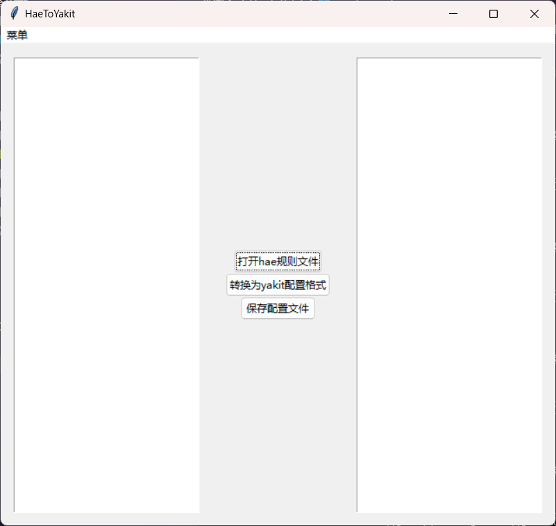
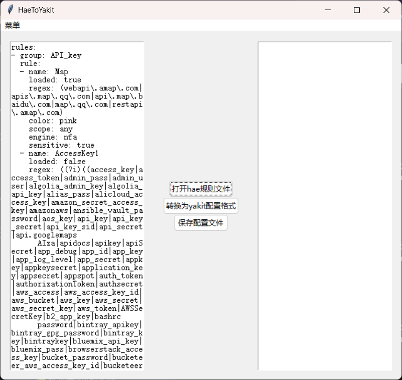
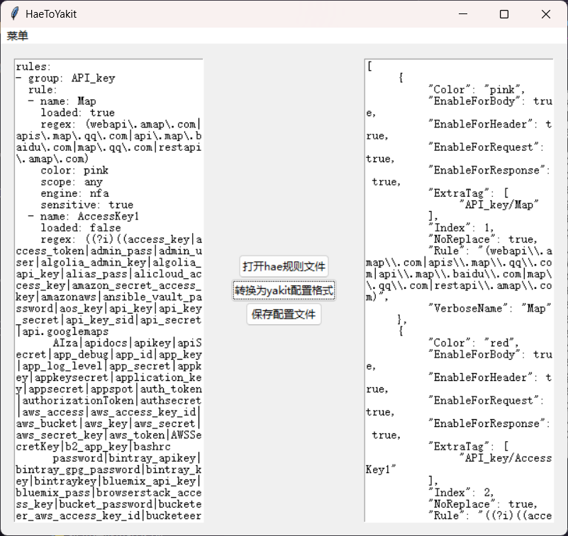
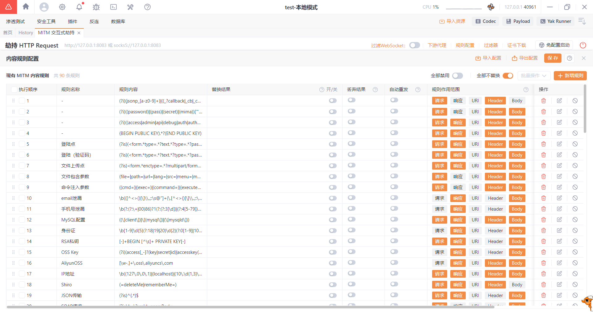
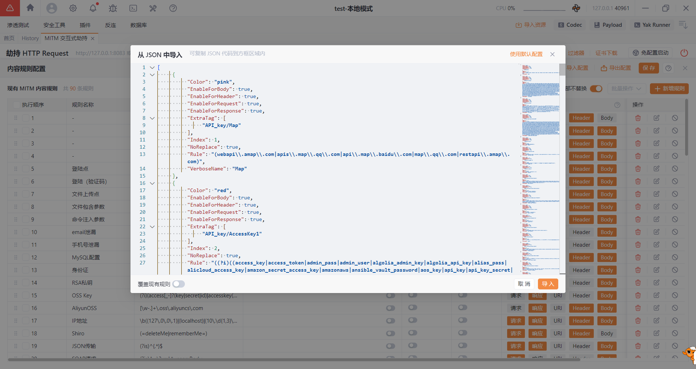

# HaeToYakit

## 介绍

HaeToYakit是一个将hae配置文件转换为yakit适配的配置文件脚本

hae是burpsuite的一个强大的插件，在挖掘src中起到快速定位敏感信息，辅助挖掘的作用。但是，梨酱根据群里的师傅的反馈，发现hae插件在burpsuite存在大流量或者数据包太大时会产生卡顿，于是想如果将hae的规则配置文件转换为yakit的规则配置文件，由yakit负责hae的功能，这样可以减轻大流量或者大数据造成的gui界面卡顿，毕竟yakit底层是由go编写的，在处理高并发，大流量有天然优势，而且该脚本也能进一步完善yakit的生态。

## 使用

```
usage: HaeToYakit.py [-h] [-f hae_rules.yaml] [-o savePath] [--gui]

options:
  -h, --help            show this help message and exit
  -f hae_rules.yaml, --file hae_rules.yaml
                        指定hae的配置文件
  -o savePath, --output savePath
                        保存指定目录
  --gui                 开启gui界面

```

该脚本带有一个gui界面,如果使用脚本时不添加任何参数时,那么将会自动开启gui模式

node.js实现

```
usage: node HaeToYakit.js [-h] -f FILE [-o OUTPUT]

将hae规则转换为yakit规则配置

optional arguments:
  -h, --help            show this help message and exit
  -f FILE, --file FILE  指定hae的配置文件
  -o OUTPUT, --output OUTPUT
                        保存指定目录
```

## 教程

1. 开启脚本

   
2. 点击打开规则文件，选择好hae规则文件
   
3. 点击转换为yakit配置格式
   
4. 点击保存配置文件，选择保存路径，或者点击yakit配置文件面板，ctrl+a进行全选，将其复制到剪贴板中
5. 开启yakit，点击mitm劫持
   
6. 点击规则配置，然后在点击导入配置，将规则文件导入
   
7. 点击导入，就可以使用了

## 更新

### 2024.9.10

1. 增加了对低版本hae规则的兼容性，现在能够解析低版本的规则
2. 修复了指定hae规则不需要生效，但是在yakit中会生效的问题
3. 修复了gui界面只能指定yaml格式的问题，增加了对yml格式的选择支持

## 作者

作者是一个普通的安全开发成员，如果这个项目对你有帮助的话，请点击右上角的⭐

梨酱最喜欢⭐⭐啦 ヾ(≧▽≦*)o*
